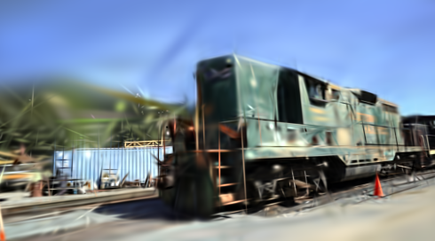
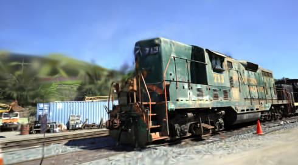

# lazy_guassian_splatting
Minimal implementation of gaussian splatting **training** in C++, relying on torch autodiff for backprop.

Includes: 
- Frustum culling
- Tile based rendering
- Adaptive densification

Even though tile based rendering is written in a parallelizable manner, I did not see any performance gains when trying to divide the tile tasks on to separate threads, since the thread launch overhead seemed larger than the work being done.

## Data requirements
Currently relies on a SFM generated sparse 3d pointcloud as input, generated in COLMAP format ([Example Dataset](https://repo-sam.inria.fr/fungraph/3d-gaussian-splatting/datasets/input/tandt_db.zip))

## Compute requirements
Due to hardware limitations, maximum number of gaussians are capped at 25'000, consuming approximately 5GB of GPU memory. Tested on NVIDIA RTX 2000 Ada GPU.

Note that this is directly correlated with render quality. For reference, SFM input cloud for the train dataset above has 182'686 points.

## Library requirements
Tested with **CUDA-12.6**, and **LibTorch 2.6.0+cu126**. When using local installation, make sure those libraries are in the path accordingly, e.g.

```bash
export PATH=/home/s0001734/Downloads/cuda-12.6/bin:$PATH
export LD_LIBRARY_PATH=/home/s0001734/Downloads/cuda-12.6/lib64:$LD_LIBRARY_PATH
cmake -DCMAKE_PREFIX_PATH=/home/s0001734/Downloads/libtorch/libtorch -DCMAKE_BUILD_TYPE=Release -S . -B build
cd build && make -j
```

## Run
```bash
./gsplat ~/Downloads/tandt_db/tandt/train/
```

## Results


Without and with adaptive densification



